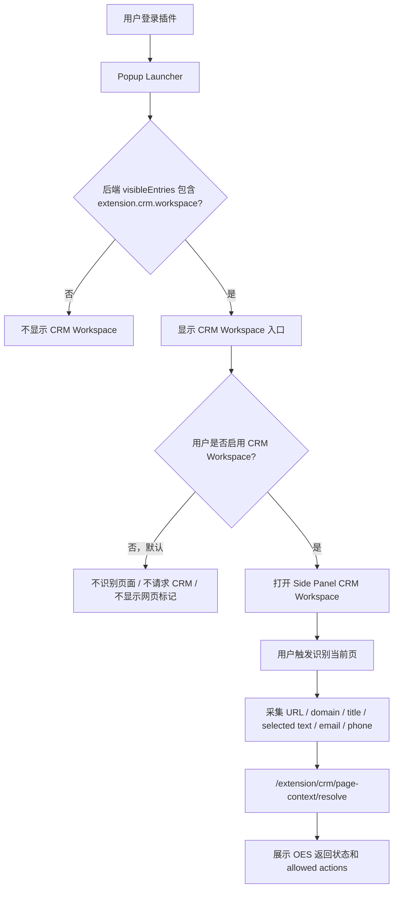
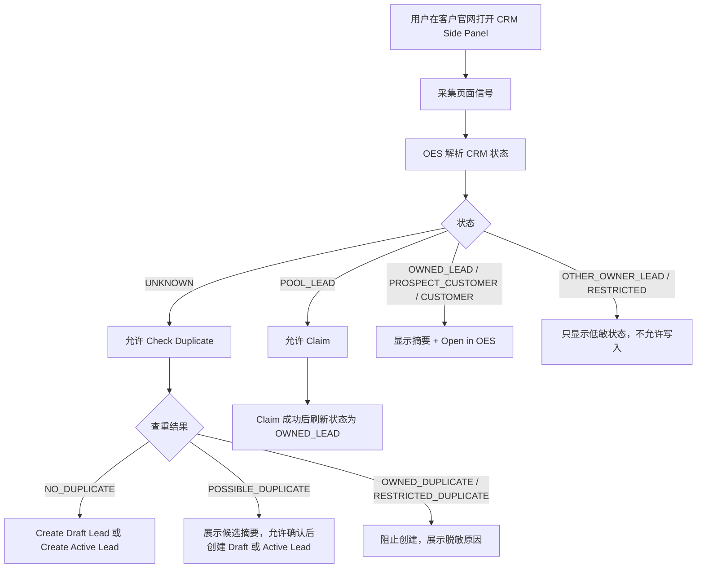
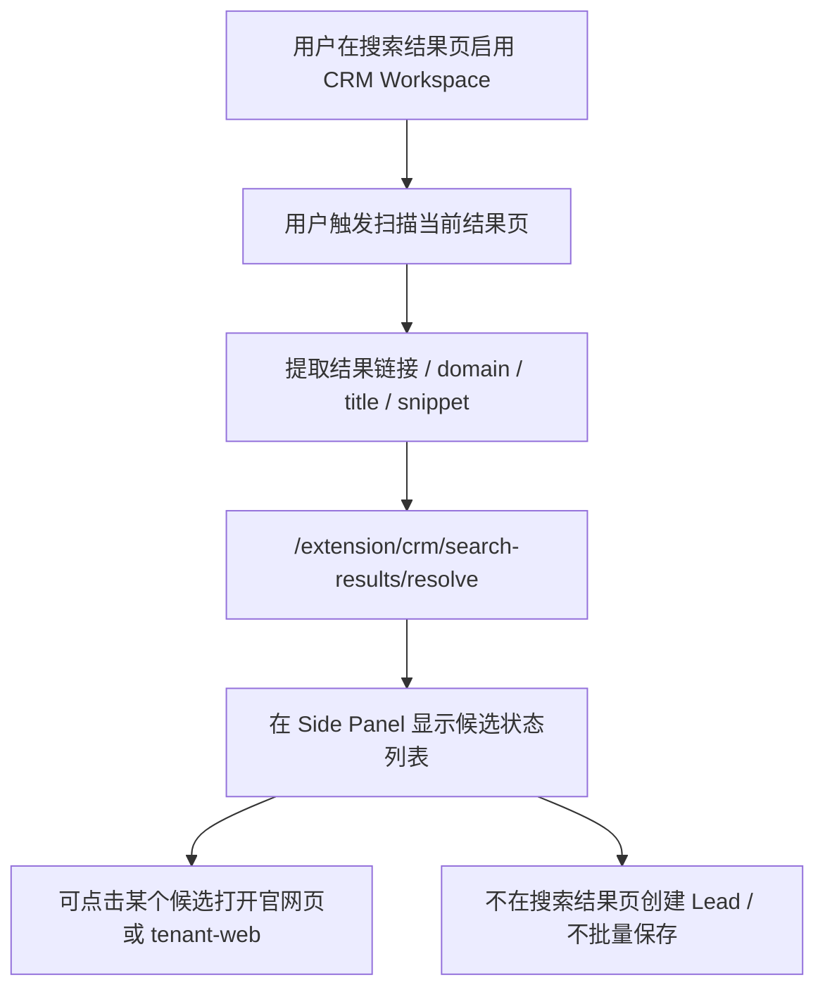

# Browser Workspace Extension Design

## 0. 文档控制

```text
designKey: browser-workspace-extension
designStatus: ACTIVE_DESIGN_WORKSPACE
lastUpdatedAt: 2026-06-23 00:00:00 Asia/Shanghai
lastUpdatedBy: Codex
supersedes:
  - docs/plans/designs/browser-prospecting-workspace.md (removed 2026-06-17)
conflictResolution: 当本文与更早浏览器插件讨论、旧 browser prospecting workspace 或旧 browser-prospecting pre-V2 delivery plan 冲突时，以本文 lastUpdatedAt 之后的冻结结论为准；稳定 architecture / ADR / contracts 明确覆盖本文时，以稳定真相源为准。
```

## 1. 目标

- 将浏览器插件重新定义为 OES 的统一浏览器工作台插件，而不是只服务销售背调的单一插件。
- 明确插件本身只承担浏览器端入口、workspace 容器和 role-aware capability 入口职责，不拥有业务真相。
- 支持不同 role 在同一插件中看到不同的 workspace、动作和可见数据。
- 为后续继续扩展更多 role 和 capability 预留稳定边界，避免重复推翻插件壳层设计。

## 2. 当前范围

- 本 workspace 负责：
  - 统一浏览器工作台插件的产品边界。
  - 插件壳层、workspace 容器和 capability 接入边界。
  - role、actionCodes、terminal access、navigation / launcher 在插件中的职责划分。
  - 销售类 workspace 与设计类 workspace 的边界隔离原则。
  - 旧 sales prospecting 插件设计中哪些结论保留、改写、丢弃。
- 本 workspace 不负责：
  - 直接冻结某个具体业务 capability 的正式后端契约。
  - 直接实现插件代码。
  - 直接定义 CRM、设计、商品、采购等正式业务主模型。
  - 直接把插件升级为租户级模块 / plugin enablement 平台。

## 3. 涉及对象

- services:
  - `api-gateway`
  - `permission-service`
  - `auth-service`
  - `identity-service`
  - future capability owners such as `crm-service`
- features:
  - unified browser workspace extension
  - role-aware browser workspaces
  - future sales workspace
  - future designer workspace
- collaborations:
  - browser extension access and session establishment
  - permission / access summary driven capability gating
  - future browser workspace to business capability collaborations

## 4. 当前已确认方向

| 日期 | 决定 | 影响范围 | 回写目标 |
| --- | --- | --- | --- |
| 2026-06-04 | 新插件主轴采用“统一浏览器工作台插件”，不是只面向销售 prospecting 的单一业务插件。 | product boundary / plugin positioning | 当前 workspace；后续 Delivery / contracts |
| 2026-06-04 | 插件首屏采用 launcher 首页，先展示当前 operator 可用的 workspace / capability 入口，而不是默认直接进入销售或其他单一 workspace。 | plugin shell / navigation / role-aware UX | 当前 workspace；后续 Delivery / contracts |
| 2026-06-04 | 插件 launcher 的一级入口单位采用 workspace，而不是直接暴露零散 capability 列表。 | launcher IA / terminal UX | 当前 workspace；后续 Delivery |
| 2026-06-04 | `browser-extension` 作为独立 terminal 参与入口可见性治理，而不是只作为 tenant-web 附属页面或前端本地插件能力。 | terminal boundary / permission integration | 当前 workspace；后续 permission / navigation write-back if needed |
| 2026-06-04 | 插件中“能不能看到某个 workspace”由后端 entry visibility 控制；“进入 workspace 后能做什么”由 actionCodes 控制。 | entry / action authorization split | 当前 workspace；后续 contracts |
| 2026-06-04 | extension terminal 下的 workspace entries 默认只服务 `browser-extension`，不默认给其他 terminal 复用。 | terminal-scoped entry governance | 当前 workspace；后续 navigation governance write-back if needed |
| 2026-06-04 | 插件应支持插件内登录，登录必须走 OES auth-bff / auth-service 链路，并由 BFF 固定可信 `browser-extension` terminal。 | auth flow / terminal session | 当前 workspace；后续 auth-bff contract |
| 2026-06-04 | 插件登录入口采用 terminal-specific BFF prefix，例如 `/extension/auth/*`，不复用 Web `/auth/*` 入口让客户端自报 terminal。 | auth-bff HTTP boundary / terminal normalization | 当前 workspace；后续 auth-bff contract |
| 2026-06-04 | 插件登录允许 account selection，但 `/extension/auth/login` 返回的 account options 应只包含允许 `browser-extension` terminal 登录的账号。 | account selection / terminal access | 当前 workspace；后续 terminal-access-policy 与 auth-bff-login contract 回写 |
| 2026-06-04 | 插件登录后的账号 / 租户切换应复用现有 account context switch / selectAccount 重签 session 语义，并固定 `terminal=browser-extension`。 | session switch / account context | 当前 workspace；后续 extension auth-bff contract |
| 2026-06-04 | extension demo 第一版登录方式先默认使用 `EMAIL_PASSWORD`，OTP / MFA 只按现有 auth flow 兼容，不作为首版重点扩展。 | login method / demo scope | 当前 workspace；后续 extension auth-bff contract |
| 2026-06-04 | 插件登录成功后的 shell 初始化复用现有 session context 与 access summary 语义：`navigation.visibleEntries` 驱动 launcher，`actionCodes` 驱动 workspace 内动作。 | session bootstrap / launcher / authorization | 当前 workspace；后续 extension auth-bff contract |
| 2026-06-17 | 插件定位收敛为浏览器中的效率入口、采集入口、轻量动作入口和 OES 双向数据交换入口，不替代 OES Web 的完整操作台。 | product boundary | 当前 workspace；后续 CRM / PLM capability design |
| 2026-06-17 | 第一批业务场景仍可面向 CRM 与 PLM，但当前线程先选择 CRM 作为第一个详细设计场景；PLM 暂不展开。 | capability sequencing | 当前 workspace；后续 CRM capability workspace / Delivery |
| 2026-06-17 | CRM 首个样板场景定义为销售目标研究与沉淀，重点支持销售在浏览器中研究潜在客户、避免重复开发、沉淀有效上下文。 | CRM workspace / sales workflow | 当前 workspace；后续 CRM capability design |
| 2026-06-17 | 插件显示的页面业务判断应来自 OES 回传结论，不由插件或 AI 自行判定目标有效性、客户归属或业务状态。 | OES truth boundary | 当前 workspace；后续 BFF / CRM contract |
| 2026-06-17 | 旧 `browser-prospecting-workspace` 已删除，后续浏览器插件设计统一从本文恢复上下文。 | docs governance / workspace cleanup | 当前 workspace |
| 2026-06-22 | 旧 `browser-prospecting-workspace` delivery plan 已删除；后续不得继续以 `/browser-prospecting/*`、`Target Workspace`、`Research Timeline`、`Research Event` 或旧 `Lead Draft` 防腐层作为插件主模型恢复实现。 | docs governance / workspace cleanup | 当前 workspace；后续新 Delivery / contracts |
| 2026-06-22 | 旧 `/browser-prospecting/*` endpoint prefix 废弃；后续浏览器插件能力应采用 extension terminal 下的 capability-specific BFF 入口，例如 CRM 场景候选 `/extension/crm/*`。 | BFF contract naming / terminal boundary | 后续 extension CRM contract |
| 2026-06-22 | 插件 P1 不消费 `ReleaseCrmAccount`，因为当前 CRM 服务真相源仍明确 P1 不支持 release 回公海；如后续需要，必须先回写 CRM 真相源并单独冻结。 | CRM alignment / action boundary | `docs/architecture/services/crm-service.md` / future feature |
| 2026-06-22 | 插件采集来源倾向采用 `BROWSER_EXTENSION` 作为入口来源类型，`WEB_RESEARCH` 仅作为来源语义或历史兼容项另行说明。 | CRM source semantics | future extension CRM contract / CRM source note |
| 2026-06-22 | CRM 插件 workspace entry 新增为 `extension.crm.workspace`，不复用 Web terminal 的 `crm.accounts / crm.pool` entry。 | terminal navigation boundary / CRM workspace entry | permission navigation seed / extension launcher mapping |
| 2026-06-22 | 插件 CRM P1 允许通过 `/extension/crm/*` BFF facade 直接调用 CRM P1 `CreateDraftLead / CreateLead / ClaimCrmAccount`，形成识别、查重、创建与 claim 的真实闭环；BFF 不拥有 CRM 业务规则。 | extension CRM BFF / CRM P1 integration | future extension CRM contract / implementation plan |
| 2026-06-22 | 当前实现基线以 `app/browser-extension` 为准，不再把 `app/web/apps/browser-extension` 作为待建目录；后续如要迁移进 `app/web` monorepo，必须单独评估。 | implementation baseline / repo layout | current workspace / future implementation plan |
| 2026-06-22 | CRM 插件 P1 前端操作形式采用 `Popup Launcher + Side Panel Workspace`：popup 只承载登录、账号菜单与 workspace 入口，CRM Sales Workspace 主流程放在浏览器 side panel。 | frontend interaction model / CRM workspace UX | future implementation plan / UI spec |
| 2026-06-22 | 所有插件 workspace 能力必须支持用户个人启用 / 停用；后端 `navigation.visibleEntries` 仍是可见性上限，用户本地开关只决定该 workspace 是否主动运行。CRM workspace P1 默认不主动运行，用户启用后才进行页面识别和 CRM 请求。 | workspace personal preference / privacy and noise control | extension shell / storage / workspace runtime |
| 2026-06-23 | CRM 插件 P1 操作流程冻结为：用户启用 CRM workspace 后才可识别当前页；客户官网页支持状态解析、查重、创建 Draft Lead、创建 Active Lead、Claim 公海 Lead 和打开 tenant-web 详情；搜索结果页只做状态回显，不创建或批量保存。 | CRM workspace P1 flow / UX contract input | future extension CRM contract / implementation plan |

## 5. 旧 Browser Prospecting 方向处置

旧 `browser-prospecting-workspace` pre-V2 delivery plan 已于 2026-06-22 删除。后续线程不得把旧 delivery plan、旧 `/browser-prospecting/*` contract 草案或旧 implementation plan 作为当前设计入口。

旧方向的核心问题不是“CRM 销售研究场景无效”，而是它把一个具体销售场景误塑造成插件主模型，容易污染统一浏览器插件壳层、权限治理和 CRM P1 事实归属。

### 5.1 保留为统一插件壳层原则

- 插件是 OES 浏览器前端入口，不是独立业务系统，也不拥有业务真相。
- 插件当前代码位于 `app/browser-extension`，作为独立 Vue / Vite Chrome extension app；本轮设计按现有实现对齐，不默认迁移目录。
- 插件必须通过 `api-gateway / BFF` 接入 OES，不直接调用业务服务。
- 插件前端按 Chrome extension runtime 拆分为 `background`、`content`、`side-panel`、`popup`、`context-menu`、`commands`、统一 `api client`。
- `side panel` 仍应作为复杂交互主工作区，`popup` 只承担轻入口。
- Chrome manifest 第一阶段仍应采用最小权限原则，不默认申请 `<all_urls>` 常驻注入。
- 插件认证不通过 content script 抓取 `tenant-web` token。
- 前端动作控制应消费 `access summary.actionCodes`，而不是前端自己从 role 名称推导权限。
- launcher 只渲染后端返回的可见 workspace entries，前端不根据 role 名硬编码显示工作台。

### 5.2 改写为 CRM workspace 局部交互

- 旧 `Target Workspace` 应改写为更通用的 `Browser Workspace` / capability-specific workspace 容器语义，避免把所有角色都绑到 sales target 模型。
- 旧“页面信息卡 + timeline + research event”模式可以保留为某类 capability 的候选交互模式，但不应成为所有 role 的统一数据模型。
- 旧 prospecting / lead draft / contact clue 只应降级为“销售 workspace 示例能力”，不再代表插件主模型。
- 旧 `browser-prospecting` 命名、endpoint prefix、delivery plan 命名不再默认延续。

### 5.3 已丢弃

- “插件第一阶段即以销售 prospecting 为唯一主线”的产品定位。
- “插件所有保存、提取、备注、跳转等输入都必须归属到 target workspace”的统一规则。
- 任何把 CRM prospecting 防腐层直接当成整个插件核心领域模型的表达。
- 旧 `/browser-prospecting/*` endpoint prefix。
- 旧 `Target Workspace / Research Timeline / Research Event / Lead Draft` 作为插件主模型的表达。

## 5.4 当前实现基线

本节记录当前仓库中已经存在的浏览器插件与 extension auth 能力，后续 P1 方案不得把这些能力重复写成“从零实现”。

当前已实现：

- `app/browser-extension` 已存在独立 Vue / Vite 插件 app。
- Chrome manifest 当前仅声明 `storage` permission 和 BFF host permissions；尚未声明 `sidePanel`、`activeTab`、`scripting`、`contextMenus` 或 commands。
- popup 已实现登录页、账号选择页、MFA 页、authenticated home view、头像菜单与 logout 按钮。
- `AuthSessionController` 已实现 restore、login、MFA complete、account selection、session refresh、logout，本地 logout 在远端失败时也会清理本地 session。
- `ExtensionAuthApi` 已调用 `/extension/auth/login`、`/extension/auth/account-selection`、`/extension/auth/mfa/complete`、`/extension/auth/session/refresh`、`/extension/auth/session/context`、`/extension/auth/logout`。
- api-gateway 已有 terminal-scoped `/extension/auth/*` controller，包含 login、account selection、MFA、refresh、logout、session context、access summary、session contexts、switch context。
- popup launcher 当前只映射 `extension.designer.workspace`，尚未映射 `extension.crm.workspace`。

当前未实现：

- 插件前端尚未调用 `/extension/auth/session/access-summary` 作为独立 action control 来源。
- 插件前端尚未实现 session context list / switch-context UI。
- 插件尚未实现 background、content script、side panel、context menu、commands 或当前 tab 页面信号采集。
- permission navigation seed 尚未提供 `extension.crm.workspace`。
- 尚未存在 `/extension/crm/*` BFF facade。
- 尚未存在 CRM Sales Workspace UI、页面识别、duplicate check、Draft Lead / Active Lead 创建或 Pool claim 插件流程。

## 5.5 CRM P1 前端操作形式

CRM 插件 P1 采用 `Popup Launcher + Side Panel Workspace`。

职责划分：

- `popup`：继续承载登录、账号选择、MFA、session restore / refresh 后的 launcher、账号菜单、logout 与 workspace 入口。
- `side panel`：承载 CRM Sales Workspace 主工作区，包括当前页面摘要、OES CRM 状态、可采集信号、查重结果和允许动作。
- `background`：负责打开 side panel、处理 context menu / commands，并在 popup、side panel、content script 之间转发当前 tab 上下文。
- `content script`：只在用户触发后采集当前页面信号，不常驻拥有业务真相。

P1 side panel 只做轻量 CRM 工作区，不替代 tenant-web CRM 详情页。

P1 side panel 包含四个稳定区域：

- 当前页面摘要：URL、domain、title、页面类型。
- OES CRM 状态：unknown、possible duplicate、owned lead、pool lead、other-owner lead、prospect customer、customer、restricted 等后端结论。
- 可采集信号：domain、title、selected text、可见 email / phone / company-like text。
- 允许动作：duplicate check、create draft lead、create active lead、claim pool lead、open tenant-web CRM detail。

不采用的方案：

- 不采用 popup 内完成全部 CRM 操作；空间不足，错误态、查重结果、表单和账号菜单容易互相挤压。
- 不采用 popup 只显示状态并跳转 tenant-web；风险低但无法形成插件采集闭环，P1 价值不足。

## 5.6 CRM P1 操作流程

CRM 插件 P1 的操作流程以用户个人启用 CRM workspace 为前提。未启用时，插件不得进行 CRM 页面识别、content script 注入、搜索结果页标记或 `/extension/crm/*` 请求。

### 5.6.1 主线流程



### 5.6.2 客户官网页流程

客户官网页是 CRM workspace P1 的主要双向页面类型。



规则：

- 插件只采集页面候选信号，不自行判断客户归属、重复、风险或权限。
- `Create Active Lead` 默认 `assignmentIntent = OWNED_BY_OPERATOR`。
- 插件采集来源默认使用 `sourceType = BROWSER_EXTENSION`。
- 后端重复检查结果仍是最终判断；前端确认不能绕过 `CLAIMABLE_EXISTING / OWNED_DUPLICATE / RESTRICTED_DUPLICATE` 等阻断。
- Pool Lead 必须先 `ClaimCrmAccount`，Claim 成功后才进入本人可继续处理状态。

### 5.6.3 搜索结果页流程

搜索结果页只做低敏状态回显，不做写入。



### 5.6.4 P1 状态与动作矩阵

| OES 返回状态 | 插件展示 | P1 允许动作 |
| --- | --- | --- |
| `UNKNOWN` | 未发现记录 | 查重、创建 Draft Lead、创建 Active Lead |
| `POSSIBLE_DUPLICATE` | 可能重复 | 展示候选、确认后创建，最终仍以后端结果为准 |
| `OWNED_LEAD` | 本人 Lead | 打开 OES 详情 |
| `POOL_LEAD` | 公海 Lead | Claim、Claim 后打开 OES |
| `OTHER_OWNER_LEAD` | 他人负责 | 低敏提示，不写入 |
| `PROSPECT_CUSTOMER` | 潜在客户 | 打开 OES 详情 |
| `CUSTOMER` | 已成交客户 | 打开 OES 详情 |
| `RESTRICTED` | 受限对象 | 低敏提示，不写入 |

### 5.6.5 P1 明确不做

- 不做 release 回公海。
- 不在插件内做 convert to Prospect Customer。
- 不创建 contact。
- 不 append activity。
- 不 append source 到已有 CRM account。
- 不做截图证据。
- 不做 AI 总结。
- 不做搜索结果批量导入。

## 6. 当前开放问题

| 日期 | 问题 | 为什么未冻结 | 下一步 |
| --- | --- | --- | --- |
| 2026-06-04 | role 到 workspace 的映射，是只通过 `actionCodes` 驱动，还是需要额外 capability summary / plugin launcher contract？ | 只靠 actionCodes 可能不足以表达 workspace 级入口组织。 | 先确认接入模型方向，再决定是否需要新 contract。 |
| 2026-06-04 | 设计师 workspace 的最小主线是什么？ | 目前只有“找适合开发的产品并发送到 OES”的方向，还未冻结对象与动作。 | 与用户确认设计师首批能力闭环。 |

## 6.1 首屏模型补充

- `launcher` 是插件壳层首页，不是某个业务 workspace 自己的首页。
- `launcher` 只负责展示“当前 operator 在当前上下文下可以进入哪些 workspace / capability”。
- `launcher` 不拥有业务真相，不替代具体业务 workspace 的读写视图。
- 某个 workspace 是否显示，不能由前端硬编码 role 名决定；当前冻结方向是由后端 entry visibility 返回 workspace entries，前端只负责渲染。
- `launcher` 允许后续继续扩展更多 role / workspace，而不要求推翻插件壳层。

## 6.2 当前冻结的插件可见性模型

- `browser-extension` 是 OES 的一个独立 terminal。
- extension terminal 的首页是 launcher。
- launcher 的一级入口是 workspace。
- 用户是否能看到某个 workspace，取决于后端是否返回该 workspace 对应的 visible entry。
- 一个同时具备多个角色能力的用户，可以同时看到多个 workspace entries。
- 用户进入某个 workspace 后，side panel、context menu、commands / 快捷键和页面动作应切换到该 workspace 的工作语义。
- workspace entry 默认是 terminal-scoped entry，先只服务 extension terminal，不默认给 tenant-web、PDA、KIOSK 复用。
- actionCodes 不负责决定 launcher 上有哪些 workspace entry；actionCodes 负责控制已进入 workspace 后的动作能力。

### 6.2.1 Workspace Personal Enablement

所有插件 workspace 能力必须支持用户个人启用 / 停用。

规则：

- 后端 `navigation.visibleEntries` 是 workspace 可见性上限；未返回的 workspace 不能被前端通过本地开关显示或启用。
- 用户本地开关只决定一个已可见 workspace 是否在当前插件中主动运行。
- 用户本地开关不授予权限，不改变 `actionCodes`，不影响 tenant-web，也不影响其他用户。
- P1 本地偏好可以保存在 extension storage 中，按当前 extension session account / tenant / workspace key 隔离。
- 默认不主动运行需要页面识别或网页注入的 workspace；用户必须显式启用后才允许启动该 workspace 的页面识别、content script 注入、context menu 动作和 capability BFF 请求。
- 关闭某个 workspace 后，应停止对应页面识别、隐藏页面标记、停止对应 capability BFF 请求，并在 launcher / settings 中保留重新启用入口。

CRM workspace P1 适用规则：

- `extension.crm.workspace.enabled` 默认为 `false`。
- 用户启用 CRM workspace 后，才允许当前页面识别、搜索结果页状态回显、官网页 CRM 操作和 `/extension/crm/*` 请求。
- 用户关闭 CRM workspace 后，不注入 CRM content script，不请求 `/extension/crm/*`，不显示搜索结果页 CRM 状态标记，不自动打开 CRM side panel。
- 如果 side panel 已打开时用户关闭 CRM workspace，side panel 应停止当前页面识别并显示 CRM workspace 已停用状态。

## 6.3 当前冻结的插件登录方向

- 插件作为独立 terminal，应支持插件内登录。
- 插件内登录不能绕过 OES auth，不引入 Firebase 或独立账号系统。
- 插件内登录应通过 extension-specific BFF 入口进入，当前冻结方向为 `/extension/auth/*`。
- extension demo 第一版默认使用 `EMAIL_PASSWORD`。
- OTP 登录、MFA 完成、factor challenge 等能力若被后端返回为 continuation state，应复用现有 auth flow response shape；首版 demo 不为这些能力新增独立语义。
- BFF 必须固定可信 `terminal=browser-extension`，不能信任客户端 payload 自行声明 terminal。
- `/extension/auth/*` 与现有 Web `/auth/*`、PDA `/pda/auth/*`、KIOSK `/kiosk/auth/*` 一样，属于 terminal-specific BFF auth entry。
- 后端应按 `browser-extension` terminal 执行 terminal login policy、terminal access、MFA、session 建立、refresh 与审计。
- 插件 session 独立于 tenant-web session；tenant-web 切换租户不应静默改变插件当前 session。
- 插件 account / tenant 切换应复用现有 account context switch / selectAccount 重签 session 语义，由 extension-specific endpoint 固定 `terminal=browser-extension`。
- 切换成功后，插件必须重新刷新 session context、access summary 与 navigation visible entries，并回到 launcher 或当前 workspace 的可用状态。
- 系统级账号是否允许 browser-extension 登录应由 terminal access / login policy 决定；当前 demo 倾向不允许系统级账号进入插件 terminal。
- 插件登录允许 account selection，但 account options 应先按 `browser-extension` terminal access 过滤。
- 系统级账号默认不出现在 extension account options 中，除非未来显式开放 browser-extension terminal access。
- 如果过滤后没有可选账号，插件登录应返回稳定 denial，例如 `NO_SELECTABLE_ACCOUNT_FOR_TERMINAL` 或同等语义，而不是返回空列表让前端猜测。
- 该过滤语义是 Web / PDA 之外的 extension terminal 规则：Web 当前仍可保持选中后再判定；PDA Phase 2 仍按设备绑定租户解析唯一账号。
- 插件 account options 的过滤语义需要回写现有 terminal access / auth-bff login 设计，因为旧 terminal access policy 曾记录“不在 account options 阶段过滤 terminal access”。

## 6.4 当前冻结的插件登录后初始化方向

- 登录、账号选择或账号切换成功后，插件应刷新 extension session context。
- extension session context 复用现有 session context 语义，返回 operator、account、tenant、terminal、allowedTerminals、navigation 等 shell 初始化字段。
- extension terminal 下，`navigation.visibleEntries` 是 launcher 可见 workspace entries 的后端真相。
- extension terminal 下，`navigation.defaultEntry` 可作为默认聚焦或默认选中 workspace entry，但不要求插件绕过 launcher 直接进入该 workspace。
- 插件不消费 Web route、menu hierarchy、defaultHomePath 等 Web compatibility 字段作为稳定真相。
- 插件应独立调用 access summary，使用 `actionCodes` 控制 workspace 内按钮、context menu、commands 和提交动作。
- 插件前端不得从 roles 推导 workspace visibility 或 action availability。

## 6.5 CRM workspace 当前讨论进度

本节记录 2026-06-17 线程中已确认或倾向确认的 CRM 插件场景方向。当前只沉淀产品边界与场景进度，不冻结 CRM 字段、正式契约、接口 DTO 或服务模型。

### 6.5.1 CRM 样板场景定位

- CRM 是当前优先详细拆解的第一个业务 workspace。
- CRM workspace 的首个样板场景是销售目标研究与沉淀，而不是完整 CRM 操作入口。
- 插件用于减少销售在 OES Web 与外部网页之间反复切换的成本。
- 插件支持双向数据流：
  - 网页上下文可以被销售主动采集并提交到 OES。
  - OES 中已有 lead / customer / 状态结论可以按权限回显到当前网页。
- 报价、订单、商机阶段推进、正式客户生命周期管理等完整 CRM 操作不属于插件职责，应回到 OES Web。

### 6.5.2 搜索引擎结果页已确认边界

- 适用页面包括 Google / Bing 等搜索结果页。
- 搜索结果页只做 OES 状态回显，不向 OES 写入业务数据。
- 插件可以识别搜索结果中的链接、域名、标题和摘要片段，并请求 OES 判断这些候选是否已有 lead / customer 或业务状态。
- OES 返回后，插件只展示低敏信息，帮助销售避免重复开发。
- 可展示信息包括：
  - 状态标签，例如未知、已有客户、已有线索、本人负责、他人负责、跟进中、无效目标、风险对象。
  - 少量辅助信息，例如负责人或团队、最近更新时间、对象类型、是否与本人相关。
- 不应展示订单、金额、报价、合同、客户等级、详细沟通内容、联系方式明细或内部备注全文。
- 搜索结果页不提供创建 lead、标记无效、加入待研究、批量保存等写入动作。

### 6.5.3 客户官网页当前设计方向

- 客户官网页是 CRM workspace 第一个真正双向的页面类型。
- 官网页需要展示 OES 识别到的相关 lead / customer，但展示内容必须由 OES 按当前 operator 权限裁剪。
- 官网页不应只依赖 domain 匹配；domain 是重要信号，但可能因为 CRM 中缺失 domain 或页面身份不稳定而匹配失败。
- 插件可以收集当前页面的候选识别信号，例如 domain、URL、页面标题、页面可见公司名、品牌名、页脚公司名、企业邮箱域名、电话、地址和社媒链接。
- 插件不决定最终匹配结论；OES 返回匹配状态、候选对象、置信或解释性状态，以及当前用户可执行动作。
- 页面展示应以 status tags、brief 摘要和跳转入口为主，不做 OES Web 的替代详情页。

### 6.5.4 官网页权限与动作边界

- 插件可以查询 OES 中 lead 和 customer 的全局去重状态，但数据控制、权限裁剪和动作授权全部由 OES 完成。
- 展示权限与写入权限分开：
  - 销售可以感知某目标已存在、被跟进、无效或存在风险。
  - 是否能看到更多 brief 信息由 OES 权限裁剪决定。
  - 是否能 append、claim 或 convert 由 OES 返回的动作能力决定。
- 当前倾向的写入边界：
  - 只能 append 到本人负责的 lead。
  - 可以 append 到本人负责的 customer。
  - 可以 append 到所属团队的 customer。
  - 不允许直接 append 到其他人的 lead / customer。
  - 不允许直接 append 到公海 lead / customer。
  - 公海 lead 必须先 claim，claim 成功后才允许 append。
  - convert 必须先 claim lead，再由 OES 判断是否允许转 customer。
- claim lead 的成功与否由 OES 判定，例如是否仍为公海 lead、当前业务员 lead 数量是否超限、是否存在冲突、是否具备权限。
- 插件只显示 claim / convert 的结果，不在前端推导业务规则。

### 6.5.5 官网页 append 与 contact 能力待继续细化

当前倾向的高价值 append 类型包括：

- 页面来源：当前 URL、domain、页面标题和采集时间。
- 销售备注：销售手写的简短判断或背调结论。
- 选中文本片段：公司介绍、产品描述、服务区域、联系方式片段或需求线索。
- 页面证据：截图、关键页面区域或网页证据。
- 标签或状态补充：具体可用标签应由 OES 控制，插件只渲染可选项。

需要重点继续讨论 contact 相关能力：

- 插件可以扫描当前页面可见邮箱地址，并提示销售存在可处理的联系人候选。
- OES 应判断邮箱是否已经存在于 contact / lead / customer 关联中。
- 若邮箱不存在，插件可以提示是否添加为 contact 候选或联系人草稿。
- 创建 contact 前必须选择或确认归属对象，且只能归属到当前用户可 append 的 lead / customer。
- 公海 lead 场景下，必须先 claim 成功，再允许添加 contact 或 append 信息。
- 不应自动批量创建联系人，避免把 `info@`、`support@`、`privacy@` 等低价值或非销售联系人灌入 CRM。
- contact 能力当前只讨论场景和边界，不冻结字段、契约或正式 CRM contact 模型。

### 6.5.6 CRM 场景后续待讨论页面类型

- LinkedIn / 社媒公司页。
- 行业目录、展会名单、B2B 平台。
- 新闻、招聘、文章和第三方资料页。
- 邮箱 / Webmail 页面。

## 7. 真相源回写计划

- 服务职责：
  - 如插件登录态、launcher、capability gating 需要改变现有 owner 边界，再回写相应 service truth。
- 服务设计：
  - CRM 服务字段、lead / customer / contact 正式模型尚未冻结前，插件 workspace 只能定义所需能力与场景边界，不反向定义 CRM 主模型。
- 协同蓝图：
  - 待冻结“插件壳层 -> BFF -> capability owner”协同后再新增 collaboration 文档。
- contracts：
  - 待冻结统一浏览器工作台插件首批 BFF contract 后新增。
  - 待 CRM 官网页、搜索结果页和 contact 候选能力进一步冻结后，再建立 CRM workspace / BFF 黑盒契约。
- Delivery：
  - 待新方案范围与设计边界足够清晰后，通过一次 Delivery 决策卡确认并由 task-owned DP 承载执行状态。
- architecture / ADR：
  - 若需要反转现有 access-summary / navigation / terminal 接入边界，再升级到 architecture / ADR。

## 8. 恢复入口

- 下次继续前先读：
  - `docs/plans/designs/browser-workspace-extension-design.md`
  - `docs/architecture/services/permission-service.md`
  - `docs/architecture/services/crm-service.md`
  - `docs/contracts/api-gateway/access-summary.md`
  - `docs/contracts/api-gateway/navigation-summary.md`
- 当前推荐下一步：
  - 冻结统一浏览器插件壳层 + CRM Sales Workspace 设计。
  - 再冻结 `/extension/crm/*` contract 与实现方案。
  - 继续拆 CRM 官网页中 append、contact candidate、claim 和 convert 的用户流程与权限反馈。
  - 暂不冻结 CRM 字段、DTO 或接口契约。
